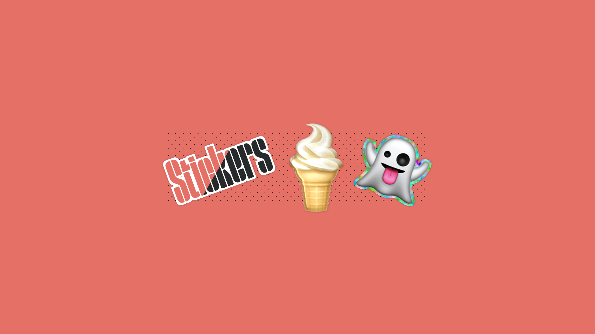

[](https://vue-stickers.netlify.app)

# vue-stickers

[](https://www.npmjs.com/package/vue-stickers)

This library provides a Vue component to display stickers on your website. Choose from three different types of stickers: `normal`, `shiny`, and `holographic`.

Styling is heavily inspired by the [sticker CSS experiments](https://expensive.toys/toys/stickers) by Artur Bień.

## Setup

```bash
# pnpm
pnpm add vue-stickers

# npm
npm i vue-stickers
```

## Usage

```vue
<script setup lang="ts">
import { Sticker } from 'vue-stickers/components'
</script>

<template>
  <Sticker>
    <!-- Use any text or emoji you want -->
    <span>🍦</span>
  </Sticker>
</template>
```

## Configuration

### Props

The sticker Vue component accepts a `type` prop to change the sticker type.


#### `type="normal"`

```html
<Sticker type="normal">
  <span style="font-size: 10rem;">Sticker</span>
</Sticker>
```

#### `type="shiny"`

```html
<Sticker type="shiny">
  <span style="font-size: 10rem;">🍦</span>
</Sticker>
```

#### `type="holographic"`

```html
<Sticker type="holographic">
  <span style="font-size: 10rem;">👻</span>
</Sticker>
```

## 💻 Development

1. Clone this repository
2. Enable [Corepack](https://github.com/nodejs/corepack) using `corepack enable`
3. Install dependencies using `pnpm install`
4. Start development server using `pnpm run dev` inside `playground`

## License

[MIT](./LICENSE) License © 2023-present [Johann Schopplich](https://github.com/johannschopplich)

[MIT](./LICENSE) License © 2023 [Artur Bień](https://github.com/arturbien)
